<!--
author:   Sebastian Zug; André Dietrich

email:    sebastian.zug@informatik.tu-freiberg.de

version:  1.0.2

language: en

narrator: UK English Female

icon:     https://media.aubi-plus.com/institution/thumbnail/3f3de48-technische-universitaet-bergakademie-freiberg-logo.jpg

link:     style.css

-->

# Sind unsere Städte bereit für Roboter?

<h3>Konzepte für die Planung von autonomen Systemen auf Fuß und Gehwegen</h3>

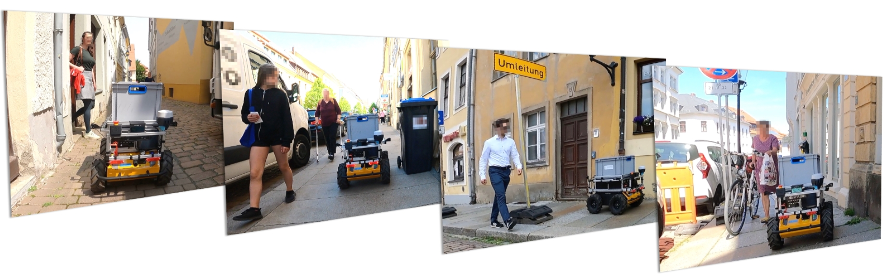

---

Prof. Dr. Sebastian Zug, Institut für Informatik

TU Bergakademie Freiberg

### Kongress für Geoinformatik und Geodäsie

### Digitale Welten - Dresden, 27.02.2024

## Chancen & Herausforderungen 

                          {{0-2}}
***********************************************************

> Anwendungsfelder für autonome Systeme reichen von Lieferdiensten, über die Wartungsaufgaben bis hin zu Begleitdiensten für Menschen ...

, Author: 'StevePotter49'")

***********************************************************

                          {{1-2}}
***********************************************************

ABER: _"... sie können aber nur eine Ergänzung zu bestehenden Prozessen und können keine vollständige Substitution darstellen."_ (Interview KEP Dienstleister)

***********************************************************

                          {{2-3}}
***********************************************************

> __Warum ist das so?__

**Heterogenität der Umgebung**

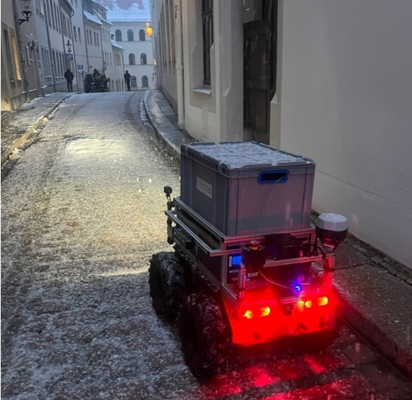

__Herausforderungen:__

+ Wegbreiten und -untergründe
+ variierende Bordsteinkanten
+ Hindernisse wie Treppen, Poller, Cafe-Tische etc.
+ Anstiege und Gefälle

**Dynamik der Umgebung**

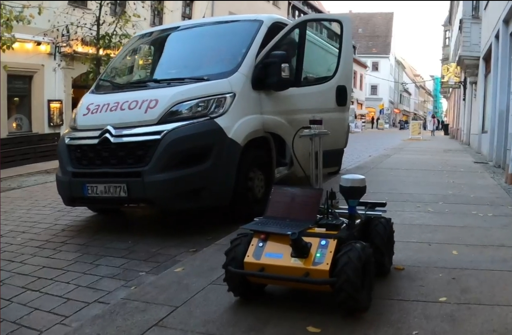

__Herausforderungen:__

+ Passanten, Radfahrerinnen, Tiere
+ Kinderwägen, Rollatoren, Rollstühle
+ Baustellen, Veranstaltungen, Märkte

**Nicht-Maschinengerechte Infrastrukturen / Konfigurationen**

__Herausforderungen:__

+ Ampelanlagen
+ fehlende Einsehbarkeit von Situation wegen der geringen Bauhöhe
+ lokal schwierige Beleuchtungssituationen

**Rechtlicher Rahmen**

__Herausforderungen:__

+ Gesetz zum autonomen Fahren (2021)
+ Autonome-Fahrzeuge-Genehmigungs-und-Betriebs-Verordnung (2022)

> __§ 1 Straßenverkehrsgesetz (StVG)__
>
> (2) Als Kraftfahrzeuge im Sinne dieses Gesetzes gelten Landfahrzeuge, die durch Maschinenkraft bewegt werden, ohne an Bahngleise gebunden zu sein.
>
> (3) Keine Kraftfahrzeuge im Sinne dieses Gesetzes sind Landfahrzeuge, die durch Muskelkraft fortbewegt werden und mit einem elektromotorischen Hilfsantrieb mit einer Nenndauerleistung von höchstens 0,25 kW ausgestattet sind ...

***********************************************************

{{3-4}}
***********************************************************

> __Ergebnis__: Die _multimodale_ Planung des Einsatzes von autonomen Systemen ist die Schlüsselaufgabe für deren Einführung.

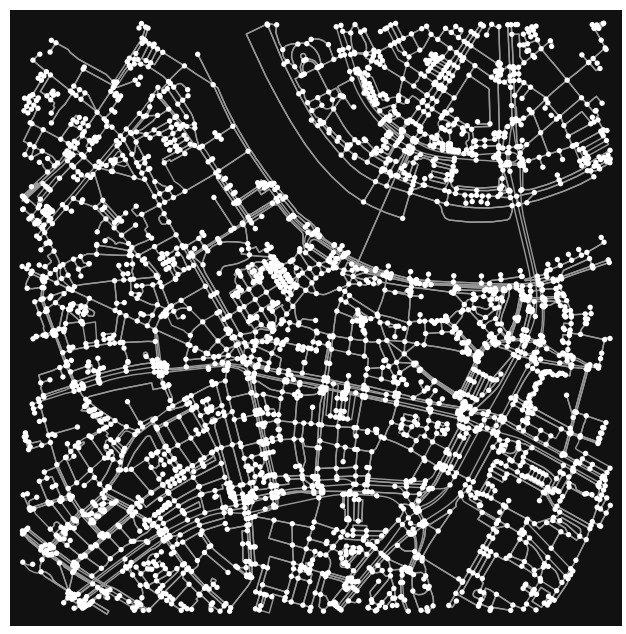
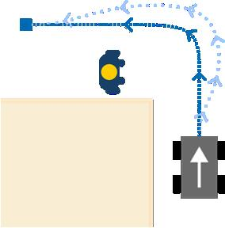

Anmerkungen: 

1. Die makroskopische Planung arbeitet auf attributierten Graphen, die mikroskopische auf Gridstrukturen.
2. Beide Aspekte sind die Grundlage für die Einrichtung von "_Attributierten Roboter Korridoren_" notwendig.

***********************************************************

## Makroskopische Planung

> __Zielstellung:__ Auf welchen Wegen kann der Roboter überhaupt fahren?

__Kriterien:__ 

1. Generelle Befahrbarkeit (z. B. Wegbreite, Bordsteinkanten, GNSS-Lokalisierungsgenauigkeit)
2. Determinismus der Ankunftszeiten (z. B. Passantenaufkommen, Länge von Umwegen im Fall von Hindernissen)

__Herausforderungen:__

+ __Streckendaten__ (z. B. OpenStreetMap, amtliche Geodaten)
+ __Attribute__ (z. B. Wegbreiten, Hindernisse, Passantenaufkommen)
+ __dynamische Daten__ (z. B. Veranstaltungen, Baustellen)

### Herausforderung Datenlage 

                    {{0-1}}
***********************************************************

Open Street Map kann die Anfragen zu Attributen der Fuß- und Radwege nur unzureichend beantworten.

<!-- data-type="none" -->
| Attribute / Tags | intercity | local | cycleway | footway | sidewalk | bicycle |
| ---------------- | --------: | ----: | -------: | ------: | -------: | ------: |
| `surface`        |       100 |    85 |       98 |      85 |       88 |      86 |
| `width`          |         1 |     8 |       14 |       3 |        5 |       7 |
| `smoothness`     |        80 |    51 |       79 |      35 |       48 |      49 |
| `max_width`      |         0 |     0 |        0 |       0 |        0 |       0 |
| `est_width`      |         0 |     0 |        0 |       0 |        0 |       0 |

_Übersicht der hinterlegten Attribute für die Straßen und Wege der Stadt Dresden aus OSM (Feb. 2024)_

***********************************************************

                    {{1-2}}
***********************************************************

Das Projekt Ready for Smart City Robots zielt darauf ab diese Lücke zu füllen und aggregiert Daten aus 

+ Fahrradleihsystemen und 
+ anhand einer Mobilfunkapp.

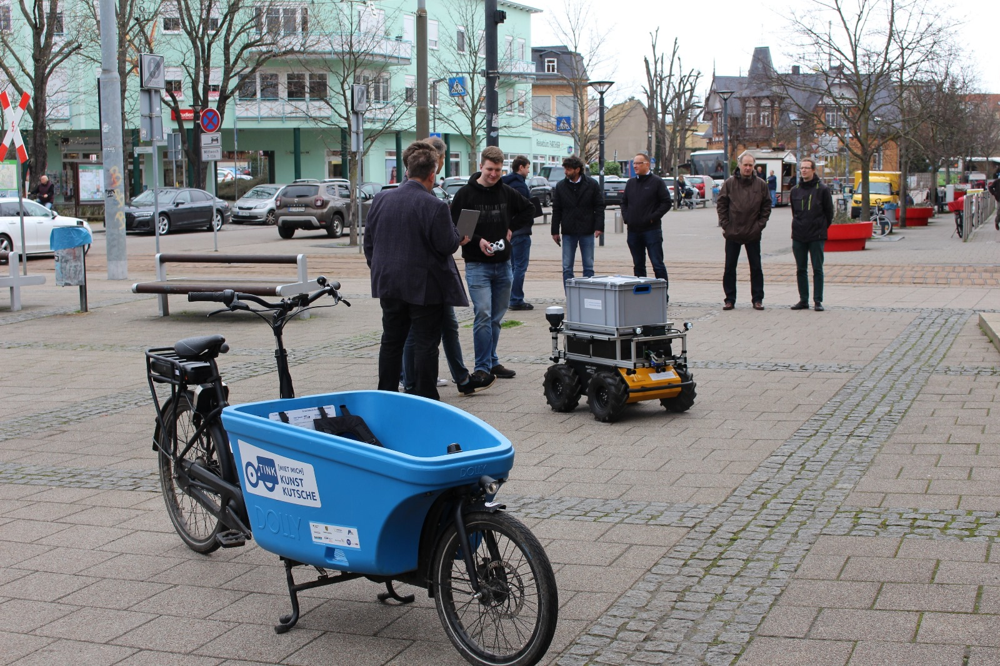

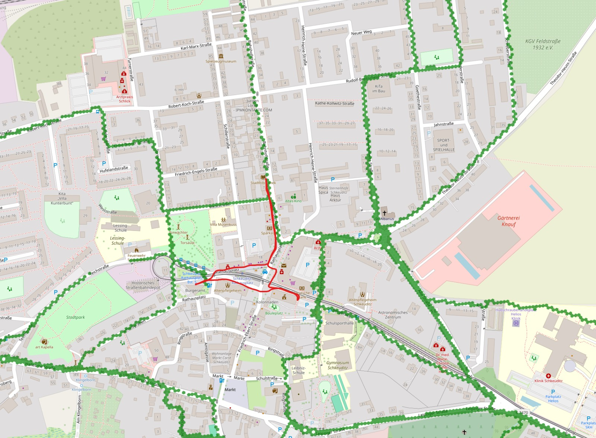

***********************************************************

### Herausforderung Attribute 

Identifikation der minimalen Wegbreiten für Fuß- und Radwege anhand eines multimodalen Datensets 

(Bachelorarbeit, Lukas Neuber, 2024)

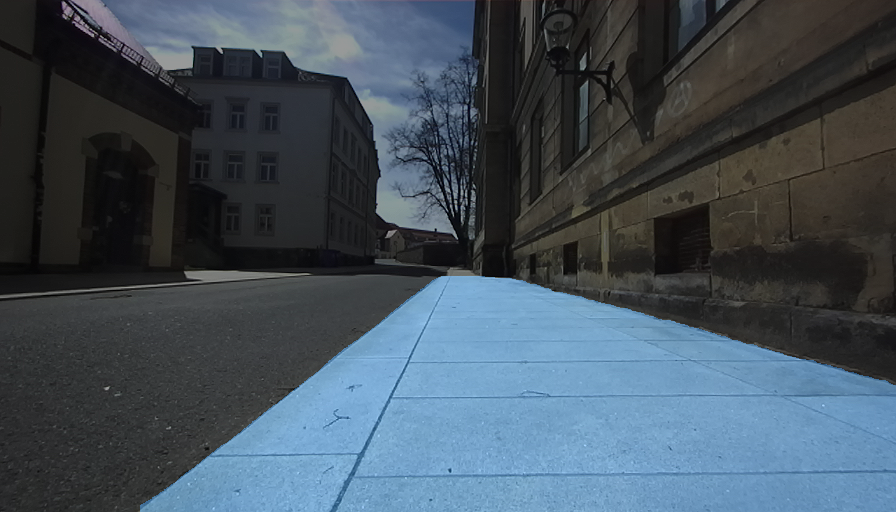

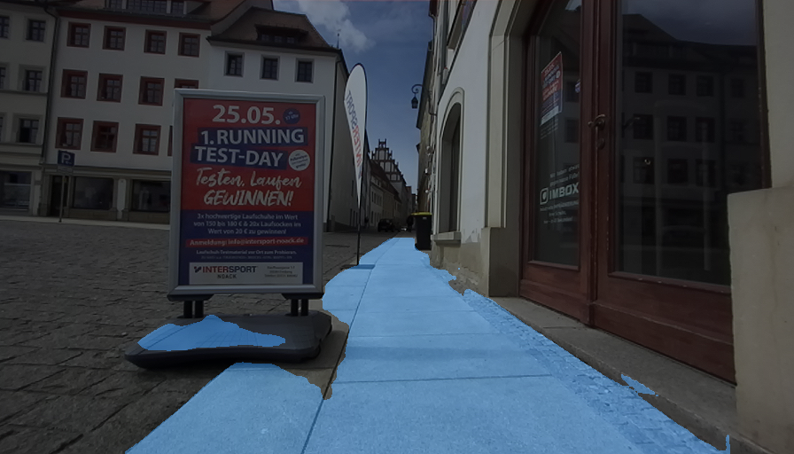

## Mikroskopische Planung

> __Zielstellung:__ Wo sollte der Roboter (wie) auf den Wegen fahren? 

__Kriterien:__ 

1. Sicherheitsgefühl, Vorhersehbarkeit (Sichtlinien, kritische Pfade)
2. Kontrollierbarkeit (Automatikmodus, manueller Modus)

__Herausforderungen:__

+ __Datenlage__ (Sichtachsen, Passantenaufkommen)
+ __Modellierung Verhaltens anderer Verkehrsteilnehmer__ (z. B. Fußgängerdynamik)
+ __Kommunikationsmöglichkeiten__ 

### Herausforderung Sicherheitsgefühl

Vergleich der Sichtlinienanalysen auf der Basis von OSM Daten und realweltlichen Messungen 

(Bachelorarbeit, Vincent Junge, 2024)

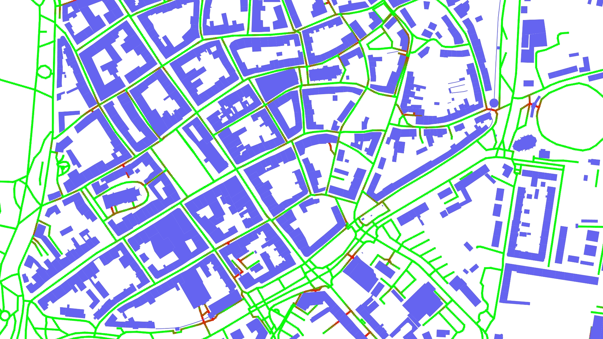

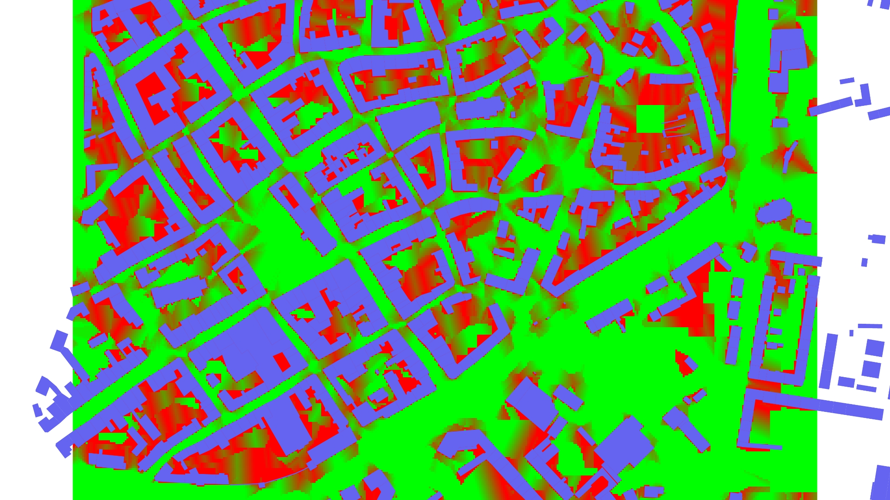

### Herausforderung Mensch

Wie verhalten sich die Menschen in der Umgebung des Roboters?

{{0-1}}
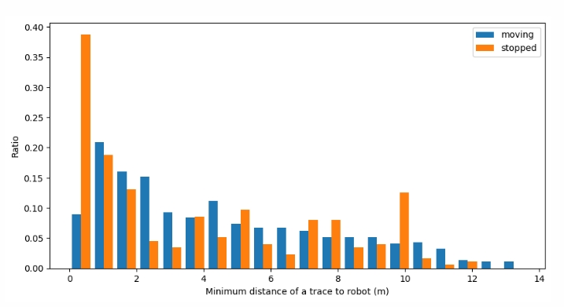

{{1-2}}
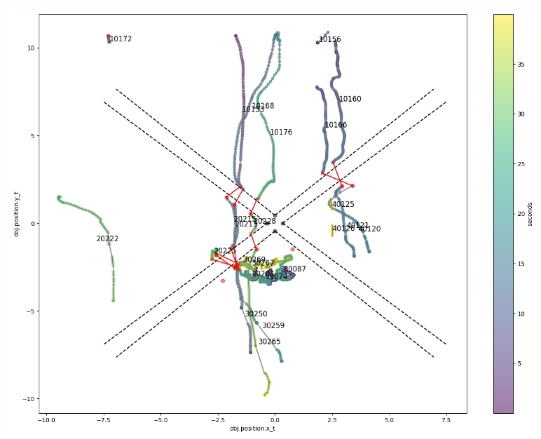

## Methodik

>Auf welchen Daten basieren die Arbeiten?

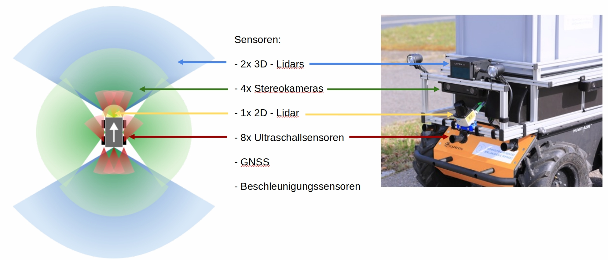<!-- width="70%" -->

Datenlage:

+ 22 Fahrten im Jahresverlauf 2022/ 23 in Freiberg
+ wiederkehrender Rundkurs mit 2.5 km Länge
+ Abdeckung unterschiedlicher Kontexte (z. B. Wochenende, Feiertage, Veranstaltungen) und Situationen (Marktplatz, Fußgängerzone, schmale Gassen)

## Fazit und Resumee

__Vision: Verlässliche Prognosen für die Bewegung von autonomen Systemen auf Fuß- und Gehwegen__

 startend vom Rathaus Dresden (rot Fußwege, blau Fuß- und Radwege)")

__Hürden auf dem Weg dahin:__

+ Datenlage, Datenlage, Datenlage, ...
+ abstrakte Akzeptanzkriterien
+ feingranulare Regularien

... aber wir sind auf einem guten Weg!

{{1-2}}
!?[Robot_meets_barrier](./images/robot_meets_barrier.mp4)<!--autoplay="true" muted="true"-->

## Referenzen

Publikationen:

<!-- class="reference" -->
> M. Plank, C. Lemardelé, T. Assmann, S. Zug, _"Ready for robots? Assessment of autonomous delivery robot operative accessibility in German cities,"_, Journal of Urban Mobility, Volume 2, 2022, [doi.org/10.1016/j.urbmob.2022.100036](https://www.sciencedirect.com/science/article/pii/S2667091722000243).

<!-- class="reference" -->
> S. Zug, N. Seyffer, M. Plank, B. Pfleging, F. Schrödel and F. W. Siebert, _"Identification of Potential Conflict Zones Between Pedestrians and Mobile Robots in Urban Situations,"_ 2023 IEEE 28th International Conference on Emerging Technologies and Factory Automation (ETFA), Sinaia, Romania, 2023, [10.1109/ETFA54631.2023.10275428](https://ieeexplore.ieee.org/document/10275428).

<!-- class="reference" -->
> M. Plank, G. Jäger, S. Zug, _"Delivery robots are not just small autonomous cars! How to close the gap in environmental data for planning their operation?"_, 2023 IEEE International Symposium on Robotic and Sensors Environments (ROSE), Tokyo, Japan, 2023, [10.1109/ROSE60297.2023.10410711](https://ieeexplore.ieee.org/document/10410711).

Relevante Projekte:

<!-- class="highlight" -->
> __Projekt:__
> [RoboTraces](https://bmdv.bund.de/SharedDocs/DE/Artikel/DG/mfund-projekte/robotraces.html), BMDV (2022 - 2023) - Hochschule Schmalkalden, TU Bergakademie Freiberg

<!-- class="highlight" -->
> __Projekt:__
> [Ready for Smart City Robots](https://bmdv.bund.de/SharedDocs/DE/Artikel/DG/mfund-projekte/r4r.html), BMDV (2022 - 2025) - TU Bergakademie Freiberg, Otto-von-Guericke Universität Magdeburg, Hochschule Anhalt, Hochschule Merseburg, TINK GmbH, DigiPL GmbH, CyFace GmbH, PTV AG, Landkreis Nordsachsen