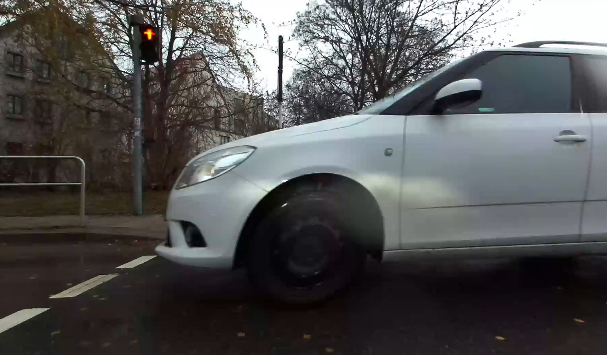

<!--
author:   Sebastian Zug; André Dietrich

email:    sebastian.zug@informatik.tu-freiberg.de

version:  1.0.3

language: de

narrator: Deutsch Female

icon:     https://media.aubi-plus.com/institution/thumbnail/3f3de48-technische-universitaet-bergakademie-freiberg-logo.jpg

link:     style.css

@onload
  LIA.settings.sound = false;
  LIA.settings.mode = "Slides";
@end

-->

# Sind unsere Städte bereit für Roboter?

<h3>Konzepte für die Planung von autonomen Systemen auf Fuß und Gehwegen</h3>

---

<section class="container">

Prof. Dr. Sebastian Zug, Institut für Informatik

TU Bergakademie Freiberg

### Kongress für Geoinformatik und Geodäsie

### Digitale Welten - Dresden, 27.02.2024

</section>

    --{{0}}--
Dieser Vortrag gibt einen Überblick über die Herausforderungen und Chancen der Planung von autonomen Systemen, die auf Fuß- und Gehwegen operieren. Er fasst die in den Projekten "Ready for Smart City Robots" und "RoboTraces" mit verschiedenen Forschungspartnern entwickelten Konzepte zusammen.

## Motivation

    --{{0}}--
Kompakte, nicht-automotive autonome Roboter lassen sich intuitiv für eine Vielzahl von Anwendungen nutzen. Der Fokus der gesellschaftlichen Diskussion liegt aktuell zwar auf  klassischen Lieferdiensten in urbanen Räumen. Die automatisierten Plattformen eröffnen aber auch eine Vielzahl von weiteren Anwendungsfeldern und Nutzungsmodelle. 

    --{{1}}--
Die Ergebnisse verschiedene Forschungsinitiativen machten deutlich, dass eine generelle Einführung von Robotern auf Fuß- und Radwegen nicht umsetzbar ist. Welche Aspekte beschränken aber den Einsatz von kleineren Robotern auf Fuß- und Radwegen, so dass sie nicht als einfach integrierbare Technologie für unsere Städte betrachtet werden können?

                          {{0-2}}
***********************************************************

> Anwendungsfelder für autonome Systeme reichen von Lieferdiensten, über die Wartungsaufgaben bis hin zu Begleitdiensten für Menschen ...

, Author: 'StevePotter49'")

***********************************************************

                          {{1-2}}
***********************************************************

__ABER:__ _"... sie können aber nur eine Ergänzung zu bestehenden Prozessen und können keine vollständige Substitution darstellen."_ (Interview KEP Dienstleister)

***********************************************************

### Herausforderungen

    --{{0}}--
Warum können wir die Visionen des automotiven Fahrens nicht einfach übertragen? 
Ein autonomes Automobil kopiert einen menschlichen Fahrer, ein autonomer Roboter ist dagegen ein neuer Akteur im urbanen Raum, für den die spezifischen Regeln erst noch definiert werden müssen. Dabei bewegt sich das Automobil in einer entsprechend strukturierten Umgebung.

    --{{1}}--
Anders als Straßen weisen Fuß- und Gehwege eine Vielzahl von Parametern auf, die sich innerhalb eines kurzen Abschnitts stark unterscheiden können. Die Herausforderung besteht darin, die Befahrbarkeit und die Sicherheit des Roboters auf diesen Wegen zu gewährleisten.

    --{{2}}--
Die Umgebung selbst ist zudem hochdynamisch - permanent treten neue Hindernisse auf bzw. werden verlagert. So ändert sich die zur Verfügung stehende Wegbreite durch aufgestellte Tische und Stühle, durch Baustellen oder durch abgestellte Kinderwägen. Das Bild zeigt eine energisch geöffnete Autotür, die temporär dem Roboter den Weg versperrt.

    --{{3}}-- 
Ampelanlagen, Schilder oder Straßenbeschriftungen sind mit Blick auf die geringe Bauhöhe des Roboters nicht einsehbar. Sie werden häufig durch Hindernisse verdeckt. Im Beispiel wäre eine robuste visuelle Erfassung der Ampelsituation außerordentlich herausfordernd. Gleichzeitig könnte der Roboter nicht beurteilen, ob auf der anderen Seite der Fußgängerampel entgegenkommende Passantinnen und Passanten warten.

    --{{4}}--
Für den Betrieb des Roboters fehlt es (noch) an einer finalen rechtlichen Einordnung und entsprechenden Regularien zu dessen Design und den grundlegenden Parametern: Welche Größe und Gewicht dürfen sie haben? Welche Geschwindigkeiten sind zulässig? Welche Sicherheitsstandards müssen eingehalten werden? 
Die entsprechenden Regularien sind in Deutschland erst in den letzten Jahren entstanden und werden aktuell weiterentwickelt.

> __Roboter auf Fuß- und Gehwegen sind keine kleinen Autos und brauchen neue Konzepte! Warum ist das so?__

**1. Heterogenität der Umgebung**

                          {{1-2}}
***********************************************************

<section class="container">

__Herausforderungen:__

+ Wegbreiten und -untergründe
+ variierende Bordsteinkanten
+ Hindernisse wie Treppen,
                          {{0-4}}
 Poller, Cafe-Tische etc.
+ Anstiege und Gefälle

</section>

***********************************************************

**2. Dynamik der Umgebung**

                          {{2-3}}
***********************************************************

<section class="container">

__Herausforderungen:__

+ Passanten, Radfahrerinnen, Tiere
+ Kinderwägen, Rollatoren, Rollstühle
+ Baustellen, Veranstaltungen, Märkte

</section>

***********************************************************

**3. Nicht-Maschinengerechte Infrastrukturen / Konfigurationen**

                          {{3-4}}
***********************************************************

<section class="container">

__Herausforderungen:__

+ Ampelanlagen
+ fehlende Einsehbarkeit von Situation wegen der geringen Bauhöhe
+ lokal schwierige Beleuchtungssituationen

</section>

***********************************************************

**4. Rechtlicher Rahmen**

                          {{4-5}}
***********************************************************

<section class="container">

__Herausforderungen:__

+ Gesetz zum autonomen Fahren (2021)
+ Autonome-Fahrzeuge-Genehmigungs-und-Betriebs-Verordnung (2022)

<!-- class="right" -->
> __§ 1 Straßenverkehrsgesetz (StVG)__
>
> (2) Als Kraftfahrzeuge im Sinne dieses Gesetzes gelten Landfahrzeuge, die durch Maschinenkraft bewegt werden, ohne an Bahngleise gebunden zu sein.

</section>

***********************************************************

### Resultierende Planungsaufgaben

  --{{0}}--
Vor dem Hintergrund der Einschränkungen beim Betrieb - zu geringen Gehwegbreiten, einem ggf. hohen Passantenaufkommen oder einer schwer einsehbaren Wegekreuzung - ist die multimodale Planung des Einsatzes von autonomen Systemen die Schlüsselaufgabe für deren Einführung. Um zulässige Trajektorien zu identifizieren, müssen sowohl die Nutzbarkeit von einzelnen Streckensegmenten (_Radweg in der XYZ-Straße_) evaluiert als auch die konkrete Pfad unter sozialen und technischen Gesichtspunkten (_Fahrt entlang der Hauswand_) festgelegt werden. Im folgenden wird dies als makroskopische und mikroskopische Planung bezeichnet. 

> __Ergebnis__: Die Herausforderungen (1), (2) und in Teilen (3) setzen für die Einführung eine roboterspezifische Überplanung eines Operationsgebietes voraus. 

Anmerkungen:

1. Die makroskopische Planung arbeitet auf attributierten Graphen, die mikroskopische auf Gridstrukturen.
2. Beide Aspekte sind die Grundlage für die Einrichtung von "_Attributierten Roboter Korridoren_" notwendig.

## Makroskopische Planung

    --{{0}}--
Bemerkenswert bei der Beantwortung der Frage ist die Tatsache, dass die Befahrbarkeit nicht nur von den Eigenschaften der Umgebung abhängt, sondern auch von der Konfiguration des Roboters selbst. 
Dessen Größe, die Fähigkeit Hindernisse zu überwinden und die Genauigkeit der individuellen Lokalisierungstechnik sind Faktoren, die eine roboterspezifische Untersuchung erforderlich machen.
Wie können die Vereinbarkeit von Roboterkonfiguration und Umgebung in einer Metrik abgebildet werden? Neben der binären _ja/nein_ Entscheidung für die Befahrbarkeit, kann auch die Verlässlichkeit beschrieben werden. Im logistischen Kontext wäre das die Planbarkeit der Fahrtdauer und damit deren Determinismus.

> __Zielstellung:__ Auf welchen Wegen kann der Roboter überhaupt fahren?

<section class="container">

__Kriterien:__

1. Generelle Befahrbarkeit (z. B. Wegbreite, Bordsteinkanten, GNSS-Lokalisierungsgenauigkeit)
2. Determinismus der Ankunftszeiten (z. B. Passantenaufkommen, Länge von Umwegen im Fall von Hindernissen)

__Herausforderungen:__

+ __Streckendaten__ (z. B. OpenStreetMap, amtliche Geodaten)
+ __Attribute__ (z. B. Wegbreiten, Hindernisse, Passantenaufkommen)
+ __dynamische Daten__ (z. B. Veranstaltungen, Baustellen)

</section>

### Herausforderung Datenlage

    --{{0}}--
Die nachfolgende Tabelle illustriert die unzureichende Datenlage für die Planung von autonomen Systemen auf Fuß- und Radwegen am Beispiel von Open Street Map (OSM).
Die Tabelle zeigt, dass die roboterrelevanten Attributen der Fuß- und Radwege, wie die Breite oder die Oberflächenbeschaffenheit bislang nur unvollständig hinterlegt sind.
Zudem existieren aktuell keine übergreifenden Karten, die Fuß- und Radwege als eigenständige Infrastruktur in großem Maßstab abbilden.

                    {{0-1}}
***********************************************************

Open Street Map kann die Anfragen zu Attributen - Wegbreite, Oberflächenstruktur, usw. - der Fuß- und Radwege nur unzureichend beantworten. Die Tabelle zeigt die prozentualen Anteile der hinterlegten Attribute für die Stadt Dresden.

<!-- data-type="none" -->
| Attribute / Tags | `local` | `cycleway` | `footway` | `sidewalk` | `bicycle` |
| ---------------- | ------: | ---------: | --------: | ---------: | --------: |
| `<surface>`      |      85 |         98 |        85 |         88 |        86 |
| `<width>`        |       8 |         14 |         3 |          5 |         7 |
| `<smoothness>`   |      51 |         79 |        35 |         48 |        49 |
| `<max_width>`    |       0 |          0 |         0 |          0 |         0 |
| `<est_width>`    |       0 |          0 |         0 |          0 |         0 |

_Übersicht der Anteile unterschiedlicher Weg- und Straßentypen mit Blick auf die hinterlegten Attribute in Dresden aus dem OSM-Datensatz (Feb. 2024)_

> Alternative öffentliche Datenquellen, die Fuß- und Radwege als eigenständige Infrastruktur mit den zugehörigen Parametern abbilden, konnten nicht identifiziert werden. 

***********************************************************

                    {{1-2}}
***********************************************************

    --{{1}}--
Das Projekt "Ready for Smart City Robots" nutzt die Daten von Radfahrerinnen und Radfahrern, um diese Lücke zu schließen.
Dabei werden zwei Konzepte verfolgt - ein community-basierter Ansatz, bei dem mit einer Mobiltelefonapp Daten zur aktuellen Wegbeschaffenheit gesammelt werden und mit den Nutzerinnen und Nutzer von Fahrradleihsystemen, wobei den Leihrädern eine hochintegrierte Sensorbox beigefügt wurde.
Das Vorhaben stellt die Vor- und Nachteile der beiden Ansätze gegenüber und wertet deren Datenqualität und -quantität aus.

Das Projekt Ready for Smart City Robots zielt darauf ab diese Lücke zu füllen und aggregiert Daten aus

+ Fahrradleihsystemen und
+ anhand einer Mobilfunkapp.

***********************************************************

### Herausforderung Attribute

> ... am Beispiel der Gewegsbreiten

    --{{0}}--
Die Grafiken illustrieren die Komplexität der dabei umzusetzenden Bildverarbeitung. Die linke Grafik zeigt das Ergebnis der Bewertung in einer einfachen Situation, der Fußweg grenzt sich deutlich von der Straße ab, die Wegbreite ist gut erkennbar. Die rechte Grafik zeigt dagegen eine Situation, in der die Wegbreite nur schwer zu bestimmen ist. Die Herausforderung besteht darin, die Wegbreite in einer Vielzahl von Situationen zuverlässig automatisiert zu bestimmen. Im Vorhaben werden dafür verschiedene Sensortypen und Verarbeitungspipelines kombiniert. 

<section class="container">

</section>

-----

_Quelle: Identifikation der minimalen Wegbreiten für Fuß- und Radwege anhand eines multimodalen Datensets (Bachelorarbeit, Lukas Neuber, 2024)_

## Mikroskopische Planung

    --{{0}}--
Die mikroskopische Planung untersucht nun, die konkrete Trajektorie des Roboters auf den Wegen.
Dies schließt die Wahl der Fahrspur, die Geschwindigkeit und die Verhaltensregeln ein.
Die Herausforderung besteht darin, die Sicherheit und Vorhersehbarkeit des Roboters zu gewährleisten.

> __Zielstellung:__ Wo sollte der Roboter (wie) auf den Wegen fahren?

<section class="container">

__Kriterien:__

1. Sicherheitsgefühl, Vorhersehbarkeit (Sichtlinien, kritische Pfade)
2. Kontrollierbarkeit (Automatikmodus, manueller Modus)

__Herausforderungen:__

+ __Datenlage__ (Sichtachsen, Passantenaufkommen)
+ __Modellierung Verhaltens anderer Verkehrsteilnehmer__ (z. B. Fußgängerdynamik)
+ __Kommunikationsmöglichkeiten__

</section>

### Herausforderung Sicherheitsgefühl

    --{{0}}--
Ein Aspekt einer defensiven Trajektorienplanung ist die Prüfung von Sichtlinien. Aus welcher Perspektive kann der Roboter aus seiner Umgebung überhaupt wahrgenommen werden? Werden die Passantinnen und Passanten möglicherweise überraschend mit dem Roboter konfrontiert? Um eine Skalierbarkeit sicherzustellen,untersucht das Team die Möglichkeit auch diese Informationen anhand von Kartendaten zu gewinnen. Die nachfolgende Grafik zeigt die Ergebnisse einer solchen Analyse auf der Basis von Open Street Map Daten, die nun mit realweltlichen Messungen verglichen werden. 

<section class="container">

</section>

_Vergleich der Sichtlinienanalysen auf der Basis von OSM Daten und realweltlichen Messungen (Bachelorarbeit, Vincent Junge, 2024)_

### Herausforderung Mensch

Für die Interaktion von Robotern und Menschen exisiert eine Vielzahl von Laboruntersuchungen, es fehlen aber große Studien, die eine realweltliches Verhalten abbilden. 

> Wie verhalten sich die Menschen in der Umgebung des Roboters in tatsächlichen Situationen?

    --{{0}}--
Die Grafiken zeigen die erste Ergebnisse einer solchen Studie, die im Rahmen des Projektes RoboTraces in Freiberg durchgeführt wurde. Das Histogramm zeigt die Verteilung der Abstände von Passanten zum Roboter. Offenbar halten die Menschen vom Roboter einen größeren Mindestsicherheitsabstand, wenn er sich bewegt. Dies Information muss in die Planung der notwendigen Breite einbezogen werden.

     {{0-1}}

  --{{1}}--
Die zweite Grafik rechts zeigt beispielhafte in einer Draufsicht die Trajektorien von Personen auf der Burgstraße in Freiberg. Die Menschen bewegen sich, wegen der Straßenführung links oder rechts am Roboter vorbei. In dieser Situation ist die Vorhersage und damit die Planung des Verhaltens einfach zu rekonstruieren. In freien Arealen ist dies ungleich schwerer. Das Ziel der Untersuchung ist es, allgemeine kontextbasierte Verhaltensregeln zu identifizieren, die in die Planung der Trajektorien einfließen können.

{{1-2}}

## Datenerhebung und Evaluation

> Wie kann die Korrektheit der Planungskonzepte überprüft werden? Auf welcher Basis entstehend die Akzeptanzkriterien?

  --{{0}}--
Die nachfolgende Grafik zeigt den Aufbau des experimentellen Robotersystem _Claudi_, das im Rahmen des RoboTraces Projektes in Freiberg eingesetzt wurde. Der Roboter wurde mit einer Vielzahl von Sensoren ausgestattet, um die Attribute der Umgebung zu erfassen und die Interaktionen mit den Passanten zu dokumentieren. 

__Datenlage:__

+ 22 Fahrten im Jahresverlauf 2022/ 23 in Freiberg
+ wiederkehrender Rundkurs mit 2.5 km Länge
+ Abdeckung unterschiedlicher Kontexte (z. B. Wochenende, Feiertage, Veranstaltungen) und Situationen (Marktplatz, Fußgängerzone, schmale Gassen)

> Das umfangreiche Datenset steht als ROS-Bags auch anderen Forschenden zur Verfügung.

## Fazit und Resumee

    --{{0}}--
Um einen "Wildwuchs" bei der Etablierung von Roboteranwendungen zu vermeiden, ist eine klare und transparente Planung anhand entsprechender behördlicher Regularien notwendig. Dies setzt aber voraus, dass die Planungskonzepte und Kriterien für autonome Systeme auf Fuß- und Gehwegen verlässlich und nachvollziehbar sind. 

  --{{1}}--
Das Anwendungsbeispiel zeigt die intendierte Nutzung der makroskopischen Planung für die Innenstadt von Dresden. Welche Reichweite könnte ein Roboter entfalten, der nur auf Fußwegen oder auf Fuß- und Radwegen operieren darf? Die Darstellung, die auf der Auswertung von OSM basiert, zeigt dass die Unterschiede zwischen den beiden Szenarien gering sind. __Allerdings schließt dies Analyse die angesprochenen Lücken in der Datenlage mit ein - aktuell können wir die Frage nicht beantworten, ob der Roboter Teile des Wegenetzes ggf. gar nicht benutzen kann.__

  --{{2}}--
Die Herausforderungen liegen dabei in der Datenlage, der Abstraktion der Akzeptanzkriterien und der feingranularen Regularien. Gleichzeitig sind die Kommunen in diesen Entwicklungsprozess einzubinden, um entsprechend der lokalen Besonderheiten diese Festlegungen zu treffen.

  --{{3}}--
An einigen Stellen funktioniert es mit der _Readiness_ aber bereits - der Roboter Claudi ist (zufällig) so groß, dass er Zugangssysteme problemlos passieren kann. Auf dem Hinweg funktioniert das übrigens auch, der Roboter passt unter der Schranke hindurch 😃.

__Vision: Verlässliche Prognosen für die Bewegung von autonomen Systemen auf Fuß- und Gehwegen__

          {{1-4}}
***********************************************************

Anwendungsbeispiel:

 startend vom Rathaus Dresden (rot Fußwege, blau Fuß- und Radwege). Grün gehalten ist die Isocrone, die bei der Verwendung aller Straßen und Weg in der gleichen Zeit erreicht werden kann.")

***********************************************************

          {{2-4}}
***********************************************************

__Hürden auf dem Weg dahin:__

+ Datenlage, Datenlage, Datenlage, ...
+ abstrakte Akzeptanzkriterien
+ feingranulare kommunale Regularien

... aber wir sind auf einem guten Weg!

***********************************************************

{{3-4}}
!?[Robot_meets_barrier](./images/robot_meets_barrier.mp4 "In Freiberg ist auch schon die Infrastruktur _Ready for Robots_")<!--autoplay="true" muted="true"-->

## Referenzen

__Publikationen:__

<!-- class="reference" -->
> M. Plank, C. Lemardelé, T. Assmann, S. Zug, _"Ready for robots? Assessment of autonomous delivery robot operative accessibility in German cities,"_, Journal of Urban Mobility, Volume 2, 2022, [doi.org/10.1016/j.urbmob.2022.100036](https://www.sciencedirect.com/science/article/pii/S2667091722000243).

<!-- class="reference" -->
> S. Zug, N. Seyffer, M. Plank, B. Pfleging, F. Schrödel and F. W. Siebert, _"Identification of Potential Conflict Zones Between Pedestrians and Mobile Robots in Urban Situations,"_ 2023 IEEE 28th International Conference on Emerging Technologies and Factory Automation (ETFA), Sinaia, Romania, 2023, [10.1109/ETFA54631.2023.10275428](https://ieeexplore.ieee.org/document/10275428).

<!-- class="reference" -->
> M. Plank, G. Jäger, S. Zug, _"Delivery robots are not just small autonomous cars! How to close the gap in environmental data for planning their operation?"_, 2023 IEEE International Symposium on Robotic and Sensors Environments (ROSE), Tokyo, Japan, 2023, [10.1109/ROSE60297.2023.10410711](https://ieeexplore.ieee.org/document/10410711).

__Relevante Projekte:__

<!-- class="highlight" -->
> __Projekt:__
> [RoboTraces](https://bmdv.bund.de/SharedDocs/DE/Artikel/DG/mfund-projekte/robotraces.html), BMDV (2022 - 2023) - Hochschule Schmalkalden, TU Bergakademie Freiberg

<!-- class="highlight" -->
> __Projekt:__
> [Ready for Smart City Robots](https://bmdv.bund.de/SharedDocs/DE/Artikel/DG/mfund-projekte/r4r.html), BMDV (2022 - 2025) - TU Bergakademie Freiberg, Otto-von-Guericke Universität Magdeburg, Hochschule Anhalt, Hochschule Merseburg, TINK GmbH, DigiPL GmbH, CyFace GmbH, PTV AG, Landkreis Nordsachsen
