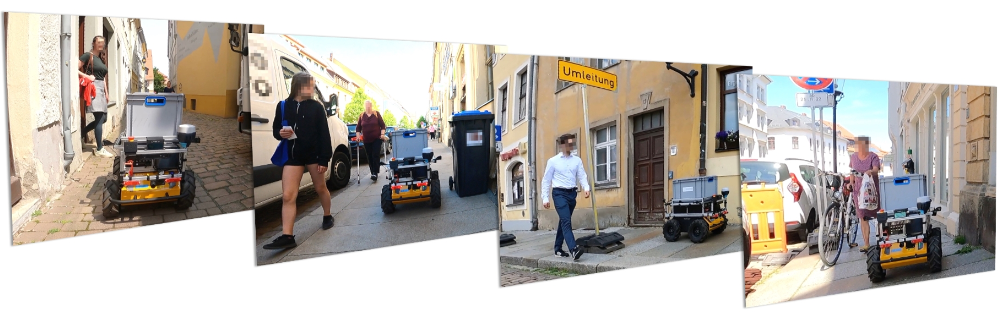
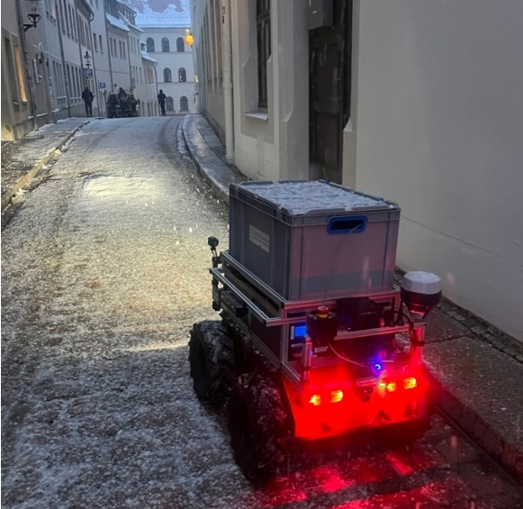
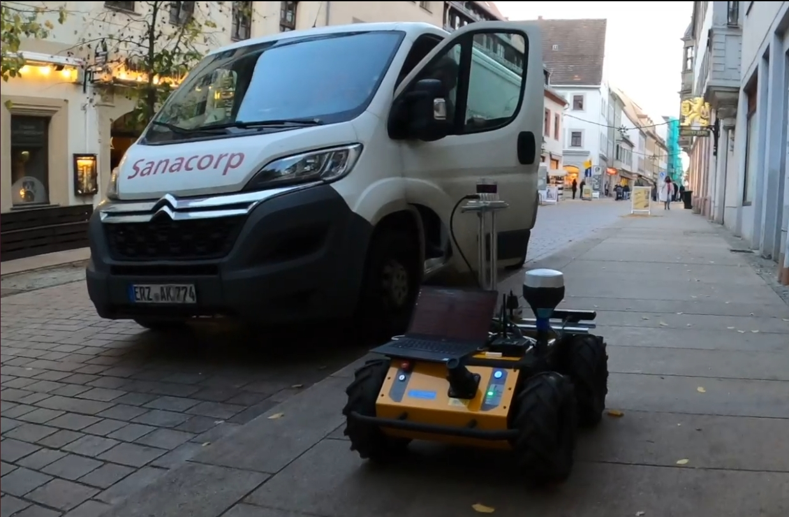
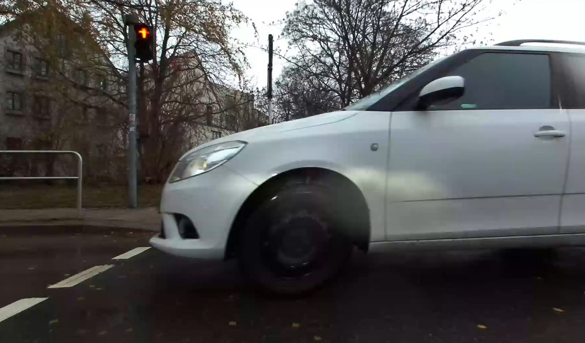
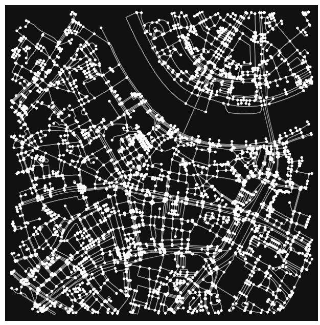
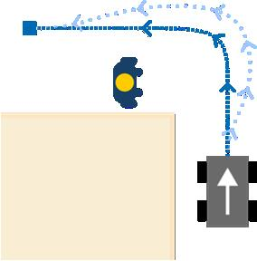
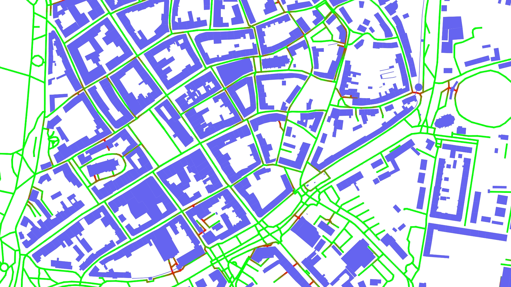
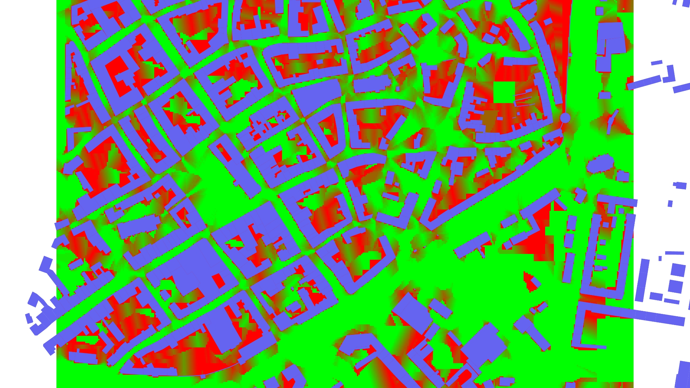

<!--
author:   Sebastian Zug; André Dietrich

email:    sebastian.zug@informatik.tu-freiberg.de

version:  0.0.2

language: en

narrator: UK English Female

icon:     https://media.aubi-plus.com/institution/thumbnail/3f3de48-technische-universitaet-bergakademie-freiberg-logo.jpg

link:     style.css

-->

# Sind unsere Städte bereit für Roboter?

<h3>Konzepte für die Planung von autonomen Systemen auf Fuß und Gehwegen</h3>

---

Prof. Dr. Sebastian Zug, Institut für Informatik

TU Bergakademie Freiberg

### Kongress für Geoinformatik und Geodäsie

### Virtuelle Welten - Dresden, 27.02.2024

## Chancen & Herausforderungen 

                          {{0-2}}
***********************************************************

> Anwendungsfelder für autonome Systeme reichen von Lieferdiensten, über die Wartungsaufgaben bis hin zu Begleitdiensten für Menschen ...

, Author: 'StevePotter49'")

***********************************************************

                          {{1-2}}
***********************************************************

ABER: _"... sie können aber nur eine Ergänzung zu bestehenden Prozessen und können keine vollständige Substitution darstellen."_ (Interview KEP Dienstleister)

***********************************************************

                          {{2-3}}
***********************************************************

> __Warum ist das so?__

**Heterogenität der Umgebung**

+ Wegbreiten und -untergründe
+ variierende Bordsteinkanten
+ Hindernisse wie Treppen, Poller, Cafe-Tische etc.
+ Anstiege und Gefälle

__Bild einer Karte einfügen!__

**Dynamik der Umgebung**

+ Passanten, Radfahrerinnen, Tiere
+ Kinderwägen, Rollatoren, Rollstühle
+ Baustellen, Veranstaltungen, Märkte

**Nicht-Maschinengerechte Infrastrukturen / Konfigurationen**

+ Ampelanlagen
+ fehlende Einsehbarkeit von Situation wegen der geringen Bauhöhe
+ lokal schwierige Beleuchtungssituationen

**Rechtlicher Rahmen**

+ Gesetz über das autonome Fahren 
+ 

***********************************************************

{{3-4}}
***********************************************************

> __Ergebnis__: Die _multimodale_ Planung des Einsatzes von autonomen Systemen ist die Schlüsselaufgabe für deren Einführung.

<!-- class="highlight" -->
> __Projekt:__
> [Ready for Smart City Robots](https://bmdv.bund.de/SharedDocs/DE/Artikel/DG/mfund-projekte/r4r.html), BMDV (2022 - 2025) - TU Bergakademie Freiberg, Otto-von-Guericke Universität Magdeburg, Hochschule Anhalt, Hochschule Merseburg, TINK GmbH, DigiPL GmbH, CyFace GmbH, PTV AG, Landkreis Nordsachsen

<!-- class="highlight" -->
> __Projekt:__
> [RoboTraces](https://bmdv.bund.de/SharedDocs/DE/Artikel/DG/mfund-projekte/robotraces.html), BMDV (2022 - 2023) - Hochschule Schmalkalden, TU Bergakademie Freiberg

***********************************************************

## Makroskopische Planung

> __Zielstellung:__ Auf welchen Wegen kann der Roboter überhaupt fahren?

__Kriterien:__ 

1. Generelle Befahrbarkeit (z. B. Wegbreite, Bordsteinkanten, GNSS-Lokalisierungsgenauigkeit)
2. Reduzierung des Konfliktpotenzials mit anderen Verkehrsteilnehmern

__Herausforderungen:__

+ __Datenlage__ (z. B. OpenStreetMap, amtliche Geodaten)
+ __Modellierung__ (z. B. Fußgängerdynamik, Hindernisverhalten)

### Herausforderung Datenlage 

Die OSM Datenbank ist eine der wichtigsten Datenquellen für die Planung von autonomen Systemen. Sie ist jedoch nicht immer vollständig und aktuell.

<!-- data-type="none" -->
| Attribute / Tags | intercity | local | cycleway | footway | path | sidewalk | bicycle |
| ---------------- | --------: | ----: | -------: | ------: | ---: | -------: | ------: |
| `surface`        |       100 |    85 |       98 |      85 |   70 |       88 |      86 |
| `width`          |         1 |     8 |       14 |       3 |    8 |        5 |       7 |
| `smoothness`     |        80 |    51 |       79 |      35 |   20 |       48 |      49 |
| `max_width`      |         0 |     0 |        0 |       0 |    0 |        0 |       0 |
| `est_width`      |         0 |     0 |        0 |       0 |    0 |        0 |       0 |

Das Projekt Ready for Smart City Robots zielt darauf ab diese Lücke zu füllen und aggregiert Daten aus Fahrradleihsystemen und von Mobilfunkapps.

ToDo Grafik überlageung Schkeuditz

### Herausforderung Modellierung 
 

 

## Mikroskopische Planung

> __Zielstellung:__ Wo sollte der Roboter (wie) auf den Wegen fahren?

Kriterium: 

1. Determinismus der Ankunftszeiten (z. B. Passantenaufkommen, Länge von Umwegen im Fall von Hindernissen)
2. Sicherheit (z. B. Sichtbarkeit, Abstand zu Passanten)

### Untersuchungs- methodik

## Fazit und Resumee

## Referenzen

<!-- class="reference" -->
> M. Plank, C. Lemardelé, T. Assmann, S. Zug, _"Ready for robots? Assessment of autonomous delivery robot operative accessibility in German cities,"_, Journal of Urban Mobility, Volume 2, 2022, [doi.org/10.1016/j.urbmob.2022.100036](https://www.sciencedirect.com/science/article/pii/S2667091722000243).

<!-- class="reference" -->
> S. Zug, N. Seyffer, M. Plank, B. Pfleging, F. Schrödel and F. W. Siebert, _"Identification of Potential Conflict Zones Between Pedestrians and Mobile Robots in Urban Situations,"_ 2023 IEEE 28th International Conference on Emerging Technologies and Factory Automation (ETFA), Sinaia, Romania, 2023, [10.1109/ETFA54631.2023.10275428](https://ieeexplore.ieee.org/document/10275428).

<!-- class="reference" -->
> M. Plank, G. Jäger, S. Zug, _"Delivery robots are not just small autonomous cars! How to close the gap in environmental data for planning their operation?"_, 2023 IEEE International Symposium on Robotic and Sensors Environments (ROSE), Tokyo, Japan, 2023, [10.1109/ROSE60297.2023.10410711](https://ieeexplore.ieee.org/document/10410711).
